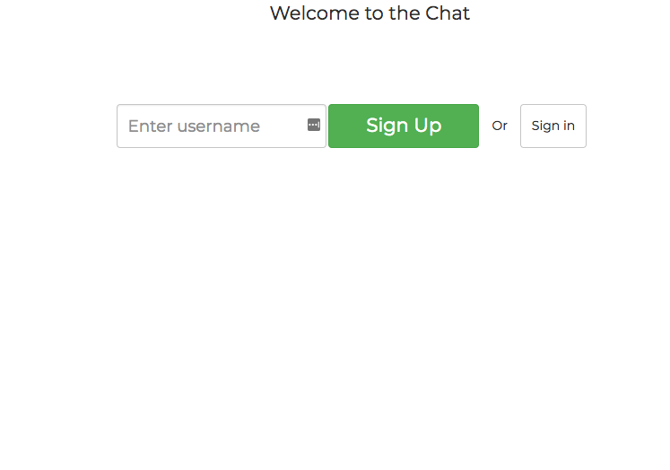
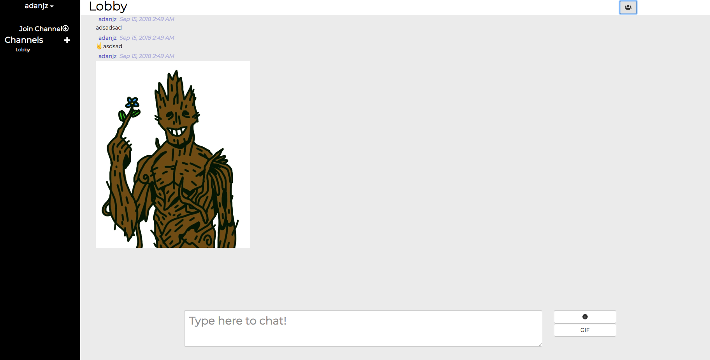
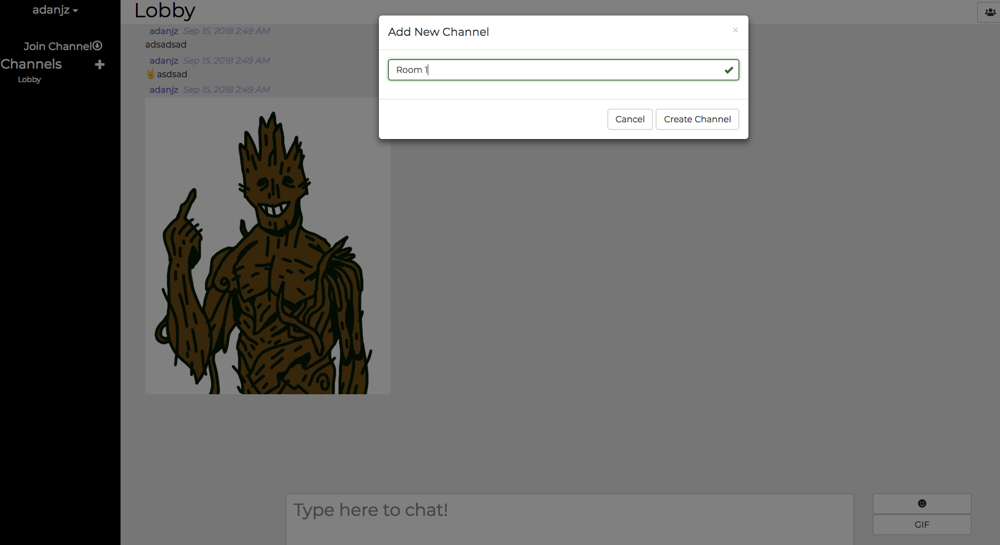
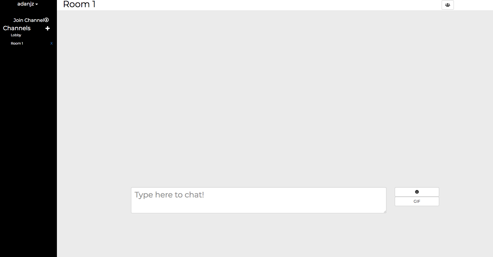
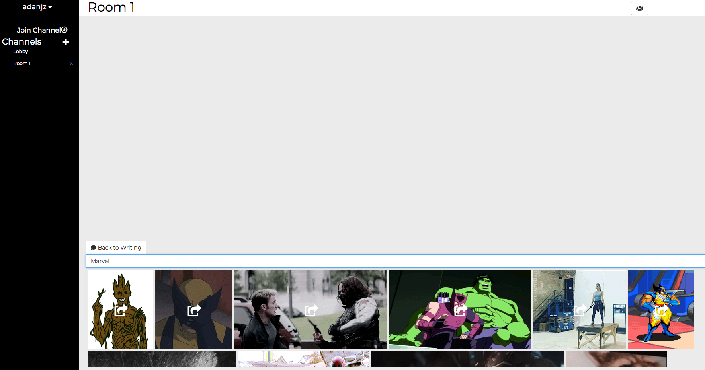

# RRSChat






To see the live version of the app go to http://rrschat.herokuapp.com

## Use Guide


You can create channels with the + sign on the nav bar on the left.
If you click on a user's name to send him a private message (opens a private channel)
You can join channels using the "Join Channel" button
You can send text messages, emojis and Gifs (Powered by Giphy)

### Development

```
npm run dev
```
And then point your browser to `localhost:4000`

Note:
This program comes with [redux-dev tools](https://github.com/gaearon/redux-devtools)
* To SHOW or HIDE the dev tool panel press ctrl+h
* To change position press ctrl+m

### Production

```
npm run build
npm start
```
And then point your browser to `localhost:4000`


### TODOs
Mount Https for google-login + fb-login


### Implementation explanantion

Environment: Docker
Backend: NodeJs+Express
Database: Mongodb (mLab)
Frontend: React+Redux+Bootstrapp
Connection: Socket.IO
Extras: Giphy+Google Login + Facebook Login

### Implemenation time logs
Environment Setup: 3hs
Basic configuration + Research: 7hs
Giphy + Emoji + Channels: 4hs
Design + Details: 4hs
